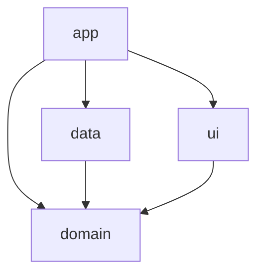

# Design: Clean Architecture & Hilt

## Architecture Overview
The project will follow a multi-module Clean Architecture approach:

### Module Responsibilities
- **domain**: Contains business logic, entities, and repository interfaces. It must not depend on any other module.
- **data**: Contains repository implementations, data sources (local/remote), and mappers. It depends on `domain`.
- **ui**: Contains UI components (Compose), ViewModels, and UI state. It depends on `domain` to use cases/repositories.
- **app**: The entry point. It depends on all modules to perform dependency injection and navigation.

## Hilt Integration
Hilt will be used for dependency injection.

### Steps
1. **Root `build.gradle.kts`**: Add Hilt classpath.
2. **`libs.versions.toml`**: Define Hilt versions, libraries, and plugins.
3. **Module `build.gradle.kts`**:
   - Apply `dagger.hilt.android.plugin`.
   - Add Hilt dependencies (`hilt-android`, `hilt-compiler`).
4. **`app` module**:
   - Create `BukuEdcApplication` annotated with `@HiltAndroidApp`.
   - Update `AndroidManifest.xml` to use the new Application class.
5. **ViewModels**: Annotated with `@HiltViewModel`.
6. **Activities/Fragments**: Annotated with `@AndroidEntryPoint`.

## Alternatives Considered
- **Koin**: While lightweight, Hilt is the recommended DI solution for Android by Google and provides better compile-time safety and integration with Jetpack components.
- **Dagger 2**: Hilt is built on top of Dagger 2 and simplifies the boilerplate significantly.
